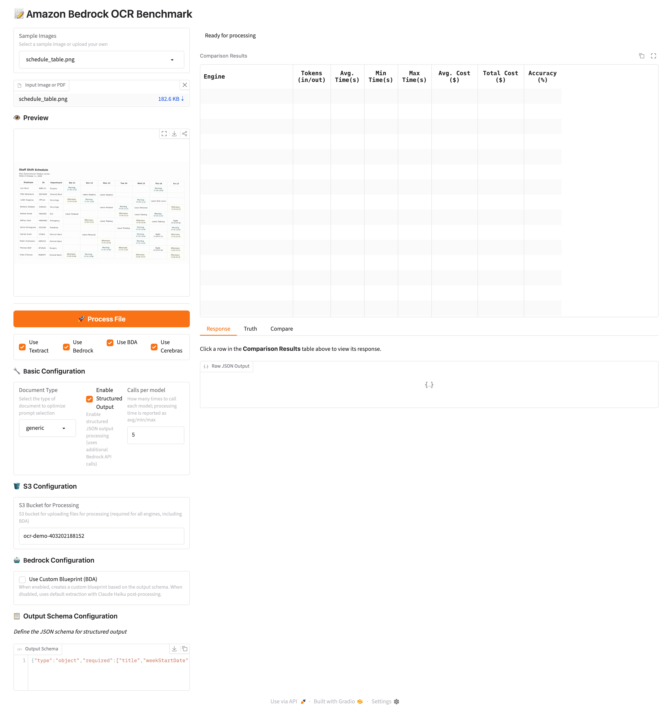

# OCR with AWS AI Services

A multi-engine OCR benchmark tool for comparing **Amazon Textract**, **Amazon Bedrock** (12 models), and **Amazon Bedrock Data Automation (BDA)** on the same documents — side by side — with latency, cost, and accuracy metrics.

## Overview

This application provides a unified interface for extracting text and structured data from images using three AWS AI services:

1. **Amazon Textract** — AWS's dedicated OCR service. After text extraction, an LLM structures the output into JSON matching the provided schema.
2. **Amazon Bedrock** — Foundation models for end-to-end vision + JSON structuring in a single call. The app benchmarks **all configured Bedrock models in parallel**, and for models that support reasoning it runs each at multiple effort levels as separate rows.
3. **Amazon Bedrock Data Automation (BDA)** — AWS's document analysis service with two modes:
   - **Custom Blueprint** — creates a custom blueprint from the JSON schema
   - **LLM Post-processing** (default) — standard BDA extraction followed by Bedrock LLM structuring



## Supported Bedrock Models

All models run through the Bedrock **Converse API** with `additionalModelRequestFields` for provider-specific reasoning parameters.

| Model | Provider | Vision | Reasoning / Effort levels |
|---|---|---|---|
| Claude Opus 4.7 | Anthropic | ✅ | adaptive: off, low, medium, high, max |
| Claude Sonnet 4.6 | Anthropic | ✅ | adaptive: off, low, medium |
| Claude Sonnet 4 | Anthropic | ✅ | budget_tokens: off, 1024, 4096, 16384 |
| Claude Haiku 4.5 | Anthropic | ✅ | budget_tokens: off, 1024, 4096, 16384 |
| Amazon Nova 2 Lite | Amazon | ✅ | reasoningConfig: off, low, medium |
| Ministral 3B | Mistral | ✅ | — |
| Ministral 8B | Mistral | ✅ | — |
| Ministral 14B | Mistral | ✅ | — |
| Pixtral Large | Mistral | ✅ | — |
| Mistral Large 3 | Mistral | ✅ | — |
| Llama 4 Maverick 17B | Meta | ✅ | — |
| Llama 4 Scout 17B | Meta | ✅ | — |

Enabling Bedrock runs **26 parallel configurations** per image (12 models × applicable effort levels).

## Key Features

- **Benchmark mode** — All 12 Bedrock models run in parallel, with reasoning-capable models expanded into separate runs per effort level
- **Row-click drill-down** — Click any row in the Comparison Results table to load that variant's raw JSON response in the Bedrock tab
- **Dynamic Compare dropdown** — The Compare tab's engine picker is populated with every engine variant that produced output, so you can diff any model against ground truth
- **Live progress indicator** — The global status shows `N/M engines completed...` while runs are in flight, switching to a "completed" banner only when all 27+ variants finish
- **Unified Converse API** — Images and PDFs processed through the same API across all providers
- **Accuracy evaluation** — Extracted JSON compared against per-sample ground truth with field-level matching; robust to schema echoes and JSON wrapped in extra text
- **Cost calculation** — Real-time cost estimation per variant (small values shown in scientific notation)
- **Effort level comparison** — For reasoning-capable models, see how `off` vs `low`/`medium`/`high`/`max` affects latency, cost, and accuracy
- **Generic schema fallback** — Samples without a specific schema automatically use a generic `{"type": "object"}` template
- **Thinking block filtering** — Reasoning/thinking content blocks are automatically excluded from extracted text
- **Long-latency safe** — 1-hour read timeout on Bedrock clients for deep reasoning runs

## Requirements

- Python 3.10+
- AWS account with Bedrock, Textract, and BDA access
- Bedrock **model access** granted for the 12 models listed above in your region
- AWS credentials configured locally
- Two S3 buckets (one for Textract/general processing, one for BDA)

## Installation

```bash
git clone https://github.com/aws-samples/ocr-with-aws-ai-services.git
cd ocr-with-aws-ai-services

python3 -m venv .venv
source .venv/bin/activate
pip install -r requirements.txt
```

Dependencies (pinned to latest stable as of April 2026):
- gradio 6.12.0
- boto3 1.42.90
- Pillow 12.2.0
- numpy 2.4.4
- pandas 3.0.2
- pymupdf 1.27.2.2

## Configure AWS

```bash
aws configure   # or set AWS_PROFILE / env vars
```

Update the default S3 bucket names in `ui.py` (or type your own in the UI at runtime):
- S3 Bucket for Processing
- S3 Bucket for BDA Processing

## Usage

```bash
python app.py
```

Open http://localhost:7860. Then:

1. **Select a sample image** from the dropdown or upload your own
2. **Pick engines** — check Textract / Bedrock / BDA
3. **Click "Process File"**
4. Review results in the comparison table — each row is a model/effort-level variant showing processing time, cost, and accuracy

## Sample Data

The repo ships with 11 sample images covering various document types:

| Sample | Has Schema | Has Truth |
|---|---|---|
| driver_license.png | generic fallback | ✅ |
| graphic.jpg | ✅ | ✅ |
| handwriting.jpg | ✅ | ✅ |
| handwriting2.jpg | ✅ | ✅ |
| insurance_card.png | generic fallback | ✅ |
| insurance_claim.png | generic fallback | ✅ |
| nutrition.jpg | ✅ | ✅ |
| provider_notes.png | generic fallback | ✅ |
| reverse_sheet.png | ✅ | ✅ |
| schedule_table.png | ✅ | ✅ |
| sheet.jpg | ✅ | ✅ |

To add your own:
1. Drop images into `sample/images/`
2. (Optional) Add a matching `sample/schema/<basename>.json` — without one, a generic template is used
3. (Optional) Add a matching `sample/truth/<basename>.json` for accuracy scoring

## Project Structure

```
.
├── app.py                      # Gradio entry point
├── ui.py                       # UI panels
├── event_handler.py            # Gradio event wiring
├── processor.py                # Parallel engine orchestration + benchmark expansion
├── sample_handler.py           # Sample loading + schema fallback logic
├── preview_handler.py          # Image/PDF preview
├── engines/
│   ├── base.py
│   ├── textract_engine.py
│   ├── bedrock_engine.py       # Converse API for all models (image + PDF)
│   └── bda_engine.py
├── shared/
│   ├── config.py               # BEDROCK_MODELS, EFFORT_LEVELS, API_COSTS
│   ├── aws_client.py           # 1-hour read_timeout for bedrock-runtime
│   ├── image_utils.py
│   ├── prompt_manager.py
│   ├── truth_handler.py
│   ├── evaluator.py            # Recursive field-level accuracy
│   ├── cost_calculator.py
│   └── comparison_utils.py
└── sample/
    ├── images/
    ├── schema/
    └── truth/
```

## License

MIT — see [LICENSE](LICENSE).
